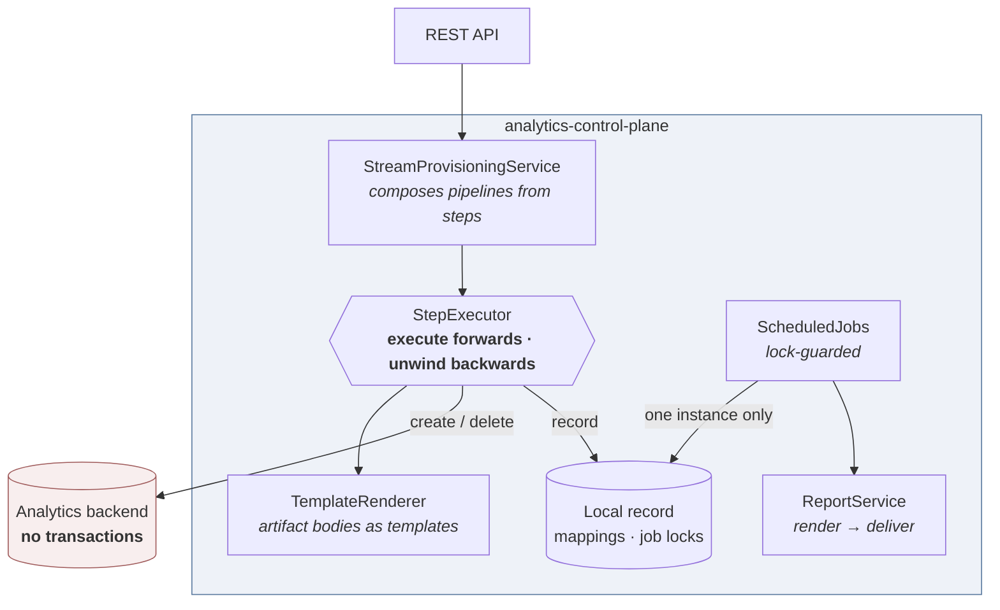

# analytics-control-plane

[](https://github.com/OmarMalas98/analytics-control-plane/actions/workflows/build.yml)


**Provisioning a set of dependent artifacts into a system that has no transactions — and undoing it
cleanly when step five of six fails.**

Standing up one data stream in an analytics platform is not one API call. It is an ingest pipeline,
a component template holding the field mappings, an index template that references both, a local
record of what was created, and a refreshed index pattern. Five or six dependent writes, in an order
that matters, across a system with **no transaction, no batch, no two-phase commit**.

Fail on the fifth and you are left with four orphans. They are invisible until the next attempt,
which collides with them and fails for a reason that has nothing to do with the actual problem.
Someone gets to work out which of them to delete, by hand, in production.

This project is about the pattern that fixes that: a **saga** — every step knows how to undo itself,
and a failure walks back through everything already done, in reverse.

> **About this project.** An original reference implementation, written to demonstrate the
> architecture of production systems I've worked on — built with a team, and not an extract from
> any employer's codebase. No proprietary code, configuration, credentials or customer detail
> appears in it. It runs on JDK 17 and Maven with no external infrastructure, and every command
> below is shown with real captured output.

---

## Architecture



---

## Core concepts

### 1. `StepExecutor` — the whole point

A `Step` has four methods in two symmetric pairs: `validate`/`execute` going forward,
`rollbackValidate`/`rollback` coming back. The executor runs them in order, and on any failure
unwinds everything already executed in reverse.

Three details are easy to get wrong and matter far more than they look:

**The failed step is rolled back too.** A step that threw part-way through may already have created
something. Rolling back only the *successful* steps is the single most common way to leave an
orphan behind — so a step is recorded as executed *before* it runs, not after.

**Each rollback is independently guarded.** One rollback throwing must not abort the rest; the
steps after it are exactly the ones still needing to be undone. Failures are collected and reported,
never allowed to stop the unwind.

**The original failure is what propagates.** A rollback error is a symptom; the caller needs the
cause. Rollback problems are attached as suppressed exceptions so nothing is lost.

`rollbackValidate` is what makes the unwind safe over a partially-executed pipeline. A step that
never got far enough to create anything declines, and the executor records *why* — so the audit
trail distinguishes "skipped deliberately" from "missed".

### 2. Reverse order is a requirement, not tidiness

The backend refuses to delete a component template while an index template still references it —
the same constraint the real system has. Unwinding in reverse detaches before it tries to delete;
unwinding in any other order fails.

You can see it in the log: creation runs inner-to-outer, the unwind runs outer-to-inner.

```
+ ingest pipeline 'refunds-pipeline'
+ component template 'refunds-mappings'
+ index template 'refunds-template'
~ attached 'refunds-mappings' to 'refunds-template'
Rolling back 6 step(s): refresh-index-pattern → persist-mapping → attach-component-template
                        → create-index-template → create-component-template → create-ingest-pipeline
~ detached 'refunds-mappings' from 'refunds-template'
- index template 'refunds-template'
- component template 'refunds-mappings'
- ingest pipeline 'refunds-pipeline'
```

### 3. The local database write is not special

`PersistMapping` sits in the middle of the same pipeline as the remote calls, and is undone the same
way. The tempting alternative — wrap the local writes in a `@Transactional` method and leave the
remote ones outside it — produces the classic hybrid failure: committed locally, absent remotely,
with the two halves disagreeing permanently.

### 4. Deletion is honest about being irreversible

Tear-down is a pipeline too, but its steps **decline** to roll back. A deleted index template cannot
be recreated from nothing — its body is gone. Pretending otherwise would log a successful rollback
that did nothing.

The mitigation is ordering: the operations most likely to fail run first, so a failure destroys as
little as possible. The local record is deleted **last**, so a partial tear-down still has something
pointing at whatever survived. That is the honest answer to an irreversible operation — you cannot
undo it, so you sequence to minimise what is lost.

### 5. Artifact bodies are templates

Building these JSON documents in Kotlin does not survive contact with reality: shapes differ per
deployment and change with the backend's version, so encoding them in code means a release for what
is really a content change. As Handlebars templates they are reviewable, diffable and editable
without a build.

The tests assert the rendered output **parses as JSON**, because a template with one stray comma
renders happily and is rejected by the backend at the least convenient moment.

### 6. A cron expression says *when*, not *how many*

Every replica has the same `@Scheduled` methods. Unguarded, three replicas means three concurrent
reconciliations fighting over the same artifacts, and recipients getting three copies of the same
report.

`JobLockService` makes the **database** the arbiter, because it is the only thing every instance
shares. Two mechanisms, both single statements whose row count *is* the answer:

- an **insert** on the job name — concurrent callers race on the primary key and exactly one wins;
- a **conditional update** that takes over a lapsed lease, so an instance that crashed holding a
  lock does not take the job down with it.

Two subtleties this code exists to demonstrate:

- **`repository.save()` does not work here.** With an assigned id it performs a merge — a `SELECT`
  followed by an `INSERT` or `UPDATE`. Those are two statements with a gap in the middle, and
  several callers will pass through that gap each believing they hold the lock. The contention test
  caught exactly this: four of eight threads "acquired" the same lock.
- **The `catch` must sit outside the transaction.** A losing insert marks its transaction
  rollback-only, and committing such a transaction throws whether or not the exception was caught.
  So the transaction boundary lives in `JobLockStore` and the `catch` in `JobLockService` — which is
  also why they are separate beans, since a self-invocation would not cross Spring's proxy and would
  get no new transaction at all.

### 7. Generic CRUD, inherited once

`BaseEntity` + `BaseService` give every managed resource typed CRUD, an optimistic-locking version,
and a `ResourceChangedEvent` published on every mutation. A control plane accumulates a long tail of
resource types; copying that per type is where the third one forgets to publish on delete and a
cache goes stale in a way nobody can reproduce.

The version column is not decoration. Control-plane resources are edited by people and automation at
the same time, and optimistic locking turns a silent lost update into a loud conflict.

---

## Run it

Requires JDK 17+ and Maven. No analytics backend, no database.

```bash
mvn spring-boot:run
```

**Provision a stream:**

```bash
curl -s -X POST http://localhost:8095/streams -H 'Content-Type: application/json' -d '{
  "stream":"orders",
  "fields":[{"name":"customer_id","type":"keyword","indexed":true},
            {"name":"amount","type":"double","indexed":false}],
  "timestampField":"created_at"}'
```
```json
{"stream":"orders","outcome":"provisioned",
 "steps":[{"step":"create-ingest-pipeline","millis":83},{"step":"create-component-template","millis":3},
          {"step":"create-index-template","millis":2},{"step":"attach-component-template","millis":0},
          {"step":"persist-mapping","millis":86},{"step":"refresh-index-pattern","millis":1}],
 "backend":{"ingestPipelines":["orders-pipeline"],"componentTemplates":["orders-mappings"],
            "indexTemplates":["orders-template"],"attachments":["orders-template ← orders-mappings"],
            "refreshedPatterns":["orders-*"]}}
```

**Now break it.** Arm a fault in the *last* step — the point at which everything else already
exists — and provision a second stream:

```bash
curl -s -X POST 'http://localhost:8095/demo/fail-next?operation=refreshIndexPattern'
curl -s -X POST http://localhost:8095/streams -H 'Content-Type: application/json' -d '{
  "stream":"refunds","fields":[{"name":"reason","type":"keyword","indexed":true}]}'
```
```json
{"stream":"refunds","outcome":"rolled back",
 "failedStep":"refresh-index-pattern",
 "detail":"Injected failure in 'refreshIndexPattern'",
 "rollbackProblems":[],
 "backend":{"ingestPipelines":["orders-pipeline"],"componentTemplates":["orders-mappings"],
            "indexTemplates":["orders-template"],"attachments":["orders-template ← orders-mappings"],
            "refreshedPatterns":["orders-*"]}}
```

Every `refunds` artifact is gone; every `orders` artifact is untouched. The response is **409**, not
500 — the request could not be applied, but the system was left consistent, and a caller can safely
retry once the cause is fixed.

Any of these can be armed: `createIngestPipeline`, `createComponentTemplate`, `createIndexTemplate`,
`attachComponentTemplate`, `refreshIndexPattern`.

**Inspect everything, including which instance is running the scheduled jobs:**

```bash
curl -s http://localhost:8095/status
```
```json
{"provisionedStreams":["orders"],
 "backend":{"ingestPipelines":["orders-pipeline"], …},
 "jobs":{"instanceId":"MSI-12456","reconcileRuns":2,"reportRuns":1}}
```

**Run a report through the render/deliver pipeline:**

```bash
curl -s -X POST http://localhost:8095/reports -H 'Content-Type: application/json' \
  -d '{"name":"Daily ingest summary","dashboard":"ingest-overview","format":"CSV",
       "recipients":["platform-team@example.test","ops@example.test"]}'
```
```json
{"report":"Daily ingest summary","successful":true,"sizeBytes":178,
 "delivered":["platform-team@example.test via log","ops@example.test via log"],"failures":[]}
```

**Tear the stream down** — the reverse pipeline:

```bash
curl -s -X DELETE http://localhost:8095/streams/orders
```
```json
{"stream":"orders","outcome":"decommissioned",
 "trail":["executed: detach-component-template","executed: delete-index-template",
          "executed: delete-component-template","executed: delete-ingest-pipeline",
          "executed: delete-mapping"],
 "backend":{"ingestPipelines":[],"componentTemplates":[],"indexTemplates":[],"attachments":[]}}
```

### Tests

```bash
mvn test
```

26 tests. `StepExecutorTest` uses recording steps so the exact order of calls is observable — the
saga's value is entirely on the unhappy path, which is by definition the one nobody exercises by
hand. `StreamProvisioningServiceTest` injects a fault at *every* stage in turn and asserts the same
thing each time: the backend is **empty**, not "mostly cleaned up".

---

## Design notes

**Why the fake backend enforces dependency rules.** `InMemorySearchBackend` refuses to attach a
missing template, and refuses to delete an attached one. A permissive fake would let a badly-ordered
pipeline pass in tests and fail in production, which is worse than no fake at all.

**Why fault injection is a feature.** `POST /demo/fail-next` exists so the rollback can be *watched*.
That is worth considerably more than a paragraph claiming it works.

**Why names are derived, in one place.** Rollback depends on it: a step that has to find what it
created in order to remove it can only do so if the name is reproducible. Scatter that convention
across six classes and the first one that drifts leaves an artifact nothing can clean up.

**Why steps share a context rather than referencing each other.** Each reads what it needs and
writes what it produced, which is what lets create and tear-down be two orderings of one set of
reusable pieces instead of two implementations.

**Kotlin.** Sealed `ValidationResult` makes an exhaustive `when` a compile-time check, and a failure
carries its reason because the type will not let it not. `data object`, default interface methods and
trailing-lambda syntax keep the step implementations to their actual content.

---

## Simplified from production

- **The backend is in-memory.** `SearchBackend` is the seam for a real analytics cluster; the
  interface already reflects its defining property — independent, immediately visible writes with no
  way to group them.
- **The PDF renderer is a placeholder.** A real one drives a headless browser: load the dashboard,
  wait for every panel to finish rendering, screenshot, assemble. `ReportRenderer` is where it
  attaches; the format dispatch around it is real.
- **Delivery only logs.** SMTP, object storage and messaging channels are further implementations of
  `DeliveryChannel`.
- **No retry or idempotency keys.** Production wants steps retried with backoff before the saga gives
  up, and idempotent creates so a retried step is safe.
- **No persisted saga log.** If the process dies *during* a rollback, nothing resumes it. Serious
  implementations journal each step's outcome so an unwind can be completed after a restart.
- **No authentication or authorisation.** Provisioning endpoints are unprotected.
- **Reconciliation only detects drift.** It logs what is missing rather than repairing it; repair is
  the obvious next step and would reuse the same provisioning pipeline.

---

## Part of a set

Four standalone projects, each isolating one problem from systems I've worked on in production.
They live in separate repositories and each runs on its own.

| Project | Language | The problem |
|---|---|---|
| **edge-relay-gateway** | Java | Serving public HTTP traffic for a private service the gateway is not allowed to connect to |
| **multitenant-relay-router** | Java | Passwordless auth, per-tenant credentials, and one request answered by many backends at once |
| **event-correlation-engine** | Java | Collapsing a high-volume event stream into a short list of things a human can work on |
| **analytics-control-plane** — *you are here* | Kotlin | Provisioning dependent artifacts into a system with no transactions — and undoing it cleanly |

---

## Licence

MIT — see [LICENSE](LICENSE).
